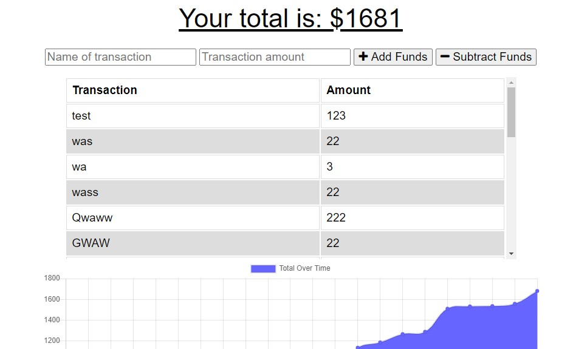

# Budget-Tracker

Github Link : https://github.com/ChrisAMK/README-GeneratorGithub
Deployed Site Link: https://warm-tundra-70984.herokuapp.com/

For this week's Homework we were tasked with adding Offline functionality to a budget tracking app that has already been developed. In doing so we are creating a PWA (Progressive Web Application) from a standard Web Application. The core concepts this homework assignment required were Caching, IndexedDB, and Service workers. The benefit of having a service worker is that your app has another process in the background running that can still be running while the app is disconnected from the server. because of this we can store files in the cache or IndexedDB so then the service worker can serve files locally instead of requesting from the server every time we load a page, it increases both performance and functionality. A cool feature of Progressive Web Applications are that they can be seperately opened from the browser to mimic a native type experience.

